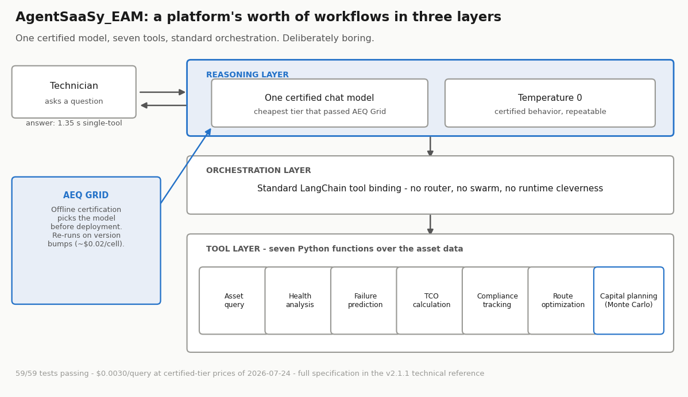
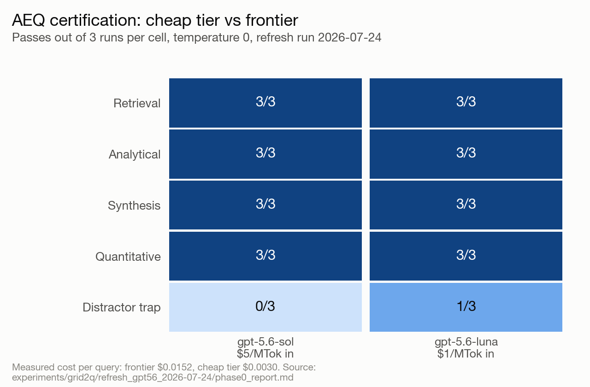
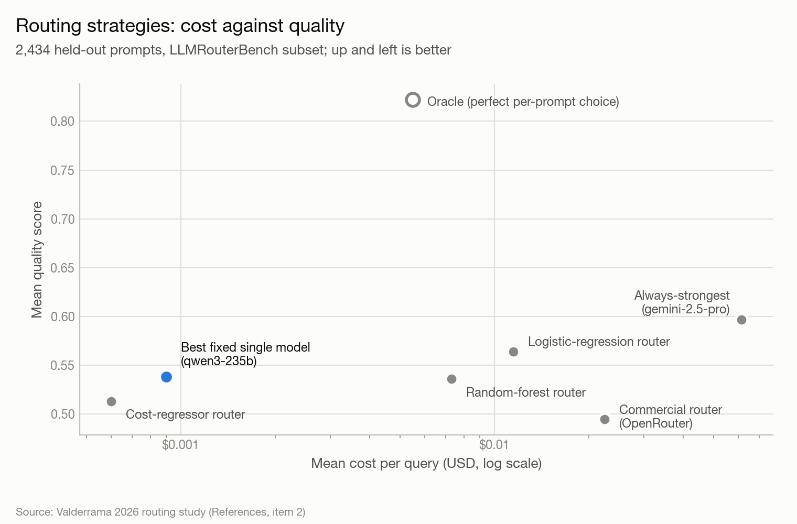
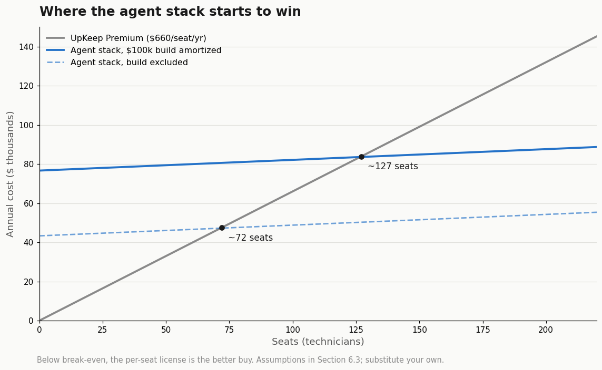
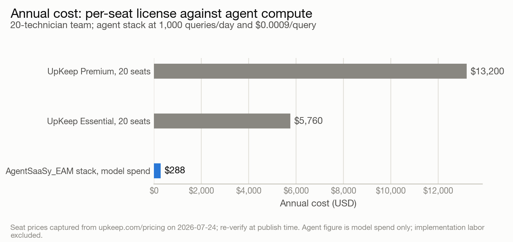

# The Cost of a Question: The Measured Economics of Certified AI Agents vs. Per-Seat SaaS

**A White Paper**

**AgentSaaSy_EAM | Enterprise Asset Management Agent Stack**

---

**Author:** Michael Valderrama
**Date:** August 7, 2026 (working draft; first drafted July 24, retitled and economics corrected August 7)
**Version:** 3.1.4 (retitled from "The Agentic Substitution"; economics corrected to the certified tier; 3.3 quantization finding scrub-verified and live-reproduced 2026-08-09; Reference 2 restated 2026-08-10 for the private routing repository; repository pointers moved to the public AEQ evidence home 2026-08-10)
**Supersedes:** none; the v2.1.0 technical reference (TECHNICAL-WHITE-PAPER.md) remains the canonical architecture document. This paper argues a thesis; that one specifies a system.
**Repository:** github.com/ibucketbranch/AEQ (public evidence home: specification, pre-registrations, run records)

> PRICING NOTE: all prices were re-verified against vendor pages on August 7, 2026. Seat prices are unchanged since the July 24 capture (UpKeep Essential $24, Premium $55, Professional and Enterprise quote-only). The certified model tier was repriced between capture and publication: gpt-5.6-luna listed at $1.00/$6.00 per million tokens on July 24 and $0.20/$1.20 on August 7. Cost-per-query figures in this paper retain the prices in force on their run dates and are therefore **upper bounds**; the repricing moves every economic conclusion further in the direction the paper argues. The routing study repository (Section 4, Reference 2) remains private; it contains team coursework, and the study's headline results are reproduced in Section 4.

---

## Abstract

Workflow SaaS is priced per seat. The marginal cost of replicating a workflow SaaS product's core functions with LLM agents is priced per token, and the token side has collapsed. This paper argues, with measurements rather than projection, that the technical moat of workflow SaaS is gone and that what remains is organizational: integrations, data custody, compliance certifications, and sales relationships. The evidence is one case study and two measurement studies. The case study is AgentSaaSy_EAM, an enterprise asset management (EAM) agent stack that reimplements the module list of a commercial EAM product in seven Python tools behind one language model, at a measured $0.0030 average cost per query on the certified tier.

The first study, AEQ Grid, is a pre-registered certification program that tests whether cheap model tiers hold up on the actual workload: on the four non-trap query classes of its hardened rubric, a $1.00-per-million-token model matched a $5.00-per-million-token frontier model 12 cells to 12, at one fifth the measured cost per query. The second study, a cost-aware routing experiment on 2,434 held-out benchmark prompts, found that one cheap fixed model rivaled every trained router and beat the commercial routing product on both cost and quality. Together they support a deployment rule that undercuts both per-seat pricing and per-request routing complexity: certify a small menu of models against your workload, default to the cheapest certified one. An exploratory run extends the floor: an open-weight model with no per-token price certified on three of the five workload classes. The paper closes with what the evidence does not prove, and with a prediction about which SaaS categories are exposed first.

---

## 1. The Claim, Stated Carefully

The strong version of the claim circulating in 2026 is "AI agents will kill SaaS." That version is unfalsifiable and mostly marketing. The version this paper defends is narrower and has numbers attached:

1. For a workflow SaaS product, defined as one whose value is dominated by rules, CRUD operations, reporting, and scheduled checks over customer data, the compute cost of replicating the product's core functions with an agent stack is now negligible relative to the product's per-seat price.
2. The models required to run that stack acceptably are not the expensive ones. Whether a cheap tier holds up is an empirical, per-workload question, and it can be answered cheaply and rigorously before deployment.
3. The remaining defensible value of the incumbent is organizational, not technical: integrations, data gravity, compliance certifications, SLAs, and the sales relationship. None of those are measured here, and Section 7 says so plainly.

Point 1 rests on the case study (Section 2) and the pricing comparison (Section 6). Point 2 rests on the AEQ Grid certification program (Section 3) and the routing study (Section 4). Point 3 is the concession the argument needs, and it does predictive work: it identifies which categories fall first (Section 8).

## 2. The Case Study: a Platform's Worth of Workflows in Seven Tools

A commercial EAM/CMMS product sells, roughly, this module list: asset registry and search, condition monitoring, predictive maintenance, cost and TCO reporting, compliance and inspection tracking, field service dispatch, and capital planning. These are sold as product tiers and priced per user per month.

AgentSaaSy_EAM implements that module list as seven Python tools bound to one language model through LangChain: asset query, health analysis, failure prediction (composite risk scoring with z-score anomaly detection), TCO calculation, compliance tracking, field route optimization, and Monte Carlo capital planning (1,000-iteration, four-strategy comparison with P10/P50/P90 bounds). The full formal specification, test inventory, and simulation methodology are in the v2.1.0 technical reference and are not repeated here.

What matters for the thesis is the size and the cost of the build, measured in early 2026 on the demo portfolio:

| Measure | Value |
|---|---|
| Tools implemented | 7 |
| Test suite | 59/59 passing (37 tool tests, 22 capital-planning tests) |
| End-to-end latency, single-tool query | 1.35 s |
| End-to-end latency, complex multi-tool query | 8.70 s |
| Average cost per query (GPT-4o-mini, early 2026, $0.15/$0.60 per MTok) | $0.0009 |
| Average cost per query (gpt-5.6-luna, certified, 2026-07-24, $1/$6 per MTok) | **$0.0030** |

Three caveats belong next to that table rather than buried in a limitations section. The demo dataset is 50 synthetic assets, not a live customer portfolio. The route optimizer was measured against statistical simulation rather than a live road network. And the two cost figures are not interchangeable: the first was measured in early 2026 on a model this program never certified, and is reported here only because it is what the v2.1.0 reference recorded. **Every economic argument in this paper uses the second figure**, the one measured on the tier that passed certification. A paper that argues for certifying before deploying does not get to price an uncertified model. The case study shows how little engineering the module list requires; it is not a production deployment report.

The architecture is deliberately boring: a reasoning layer (one chat model, temperature 0), a tool layer (seven functions over a DataFrame), an orchestration layer (standard tool binding). The architecture-efficiency claim behind this design is separately validated: the same three-architecture comparison ran live on two vendors' APIs, and the pattern held on both (see the AEQ specification and its run records). The interesting question was never whether this could be built, but whether it holds up on a cheap model, and what that does to the economics. That is what the two studies measure.

## 3. Study One: Does the Cheap Model Hold Up? (AEQ Grid)

### 3.1 Method

AEQ Grid is a certification program I created because no public benchmark answers the question an operator actually faces: is the cheapest model good enough for this specific workload. It is a named application of AEQ (Agent Efficiency Quotient), the architecture quality metric specified in AEQ Specification v1.1; the metric measures how well an agent is built, and the Grid certifies whether a model is adequate for a workload. Public leaderboards rank models against each other in the abstract; AEQ Grid certifies a model against a named workload, at a stated price, with a pre-registered bar it must clear. This paper applies it to the AgentSaaSy_EAM workload, but the method is workload-agnostic, and the pre-registration series in the repository documents it in reusable detail. Its discipline, developed across four runs and recorded in an append-only lessons ledger, is the part most evaluation efforts skip:

- **Pre-registration before execution.** Query classes, rubrics, gates, and priors were registered before each run (versions 1.0 through 1.3); every amendment was recorded before the run it governs. Improvements never touched a live run.
- **A calibration gate.** No rubric certifies anything until it has demonstrably failed a weaker system. The first rubric saturated (every tier passed everything) and was therefore discarded as certifying nothing.
- **Five query classes** drawn from the workload: retrieval, analytical ranking, synthesis, a distractor trap, and quantitative derivation.
- **Cross-family judging.** An Anthropic judge scores OpenAI candidates and vice versa, never same-family. Every FAIL verdict is independently re-adjudicated; a judge is a measurement device and gets its own error model.
- **Temperature 0, three runs per cell.** Failures proved stable: every failing model failed the same way three out of three times, which makes a certification durable until a model version changes.
- **Deprecation and pricing hygiene.** A pre-publication check found the original test models deprecated with unlisted prices; the program re-ran on current models with prices verified against official pages the same day. A result on a model a reader cannot access or price is a demo, not evidence.

### 3.2 Results (refresh run, July 24, 2026, prices verified same day)

Frontier reference: gpt-5.6-sol at $5.00 / $30.00 per million tokens (input/output). Cheap tier: gpt-5.6-luna at $1.00 / $6.00. Judge: claude-opus-4-8, cross-family for all OpenAI cells.

A note on the judge pin. claude-opus-4-8 has since been superseded, and the pin is retained deliberately: a judge is a measurement instrument, and verdict comparability across this program's runs requires a fixed instrument. Re-judging historical cells with a newer judge would confound changes in the models under test with changes in the measuring device. The pin is re-evaluated per program, not per run, and any future program that adopts a new judge starts its comparisons fresh.

| Query class | Frontier ($5/MTok) | Cheap tier ($1/MTok) |
|---|---|---|
| Retrieval | 3/3 | 3/3 |
| Analytical | 3/3 | 3/3 |
| Synthesis | 3/3 | 3/3 |
| Quantitative | 3/3 | 3/3 |
| Distractor trap | 0/3 | 1/3 |
| **Non-trap total** | **12/12** | **12/12** |
| Measured cost per query | $0.0152 | $0.0030 |

On every non-trap class, the cheap tier was indistinguishable from the frontier reference, at one fifth the measured cost per query. On the trap class it did slightly better than the frontier. The pre-registered prior for this run (cheap tier fails 2 to 6 of 15 with failures concentrating in the hard classes) was confirmed: it failed exactly 2, both in the trap class.

The size of this evidence base is stated plainly rather than left for a critic to discover: five query classes, one registered query per class, three temperature-0 runs per cell. That is an existence proof about this workload, not a population statistic. What makes it evidence is the pre-registered bar and the calibration gate; what makes it durable is that temperature-0 failures repeat exactly, so a certification stands until a model version changes rather than until a sample fluctuates.

### 3.3 The two findings that were not supposed to happen

**The trap catches the frontier.** The distractor class centers on an asset with a health score of 52, two points above the explicit critical threshold of 50, described in an urgent-sounding field note. The rule is stated in the evidence; the urgency is noise. The frontier model added the asset to the critical list 3 out of 3 times. Across the program's runs, every model family and size fell for this at least once. Models over-weight emotionally salient text against numeric thresholds, and that is precisely the class of error that costs money in a production agent. Two implications: rubrics without a trap class overstate every model, and "use the biggest model" is not a control for this failure mode, since the biggest model failed it most consistently.

**Quantization did not order capability.** In a paired run on pinned local weights, a 4-bit quantized 3B model passed 3 cells where its own fp16 parent passed 0, on the identical rubric. This result was treated as a harness artifact until proven otherwise and subjected to a forensic scrub (chat template, sampling configuration, stop-token handling, and inference stack were each audited against the run artifacts) and a live reproduction on freshly pulled weights sixteen days after the original run: the quantized model reproduced its correct derivation character-for-character, and the fp16 parent reproduced its confabulation structurally, three runs out of three each. The scrub report is published in the AEQ repository (runs/phase1_2026-07-24/SCRUB_REPORT.md at github.com/ibucketbranch/AEQ). Between separate runs, a 7B model failed a quantitative class by fabricating internally consistent numbers while a 3B model pulled the correct inputs and divided them correctly. Capability is per-class and per-workload, not per-parameter-count or per-precision. The only way to know what a given model does on a given workload is to measure that pair.

### 3.4 Exploratory: open-weight models on consumer hardware (run of July 29, 2026)

A registered extension (pre-registration v1.4 through v1.4.2) asked whether current open-weight models on a consumer desktop pass the same rubric: qwen3.5 (9.7B, 4-bit) and gemma4 (12B, 4-bit), pinned by digest, served locally on a 16 GB machine, judged identically, exploratory and outside the calibration gate.

The smaller model did better. qwen3.5 matched the frontier 3/3 on retrieval, synthesis, and quantitative derivation, at zero marginal compute cost. It failed the analytical class deterministically (the same wrong ranking three times out of three) and failed the trap class a new way: it spent its entire output budget reasoning and never produced an answer, a silent failure mode specific to thinking-style models that a production deployment would need to guard with a token-budget alarm. gemma4, despite more parameters, passed only synthesis and quantitative, repeating Section 3.3's lesson that size does not order capability. Mean local latency was 280 to 335 seconds per answer against 4 to 8 seconds over API, measured under shared host load and reported as an upper bound.

The registered prior held in part and missed in part, and the run report records both: the prediction that quantitative derivation would be the likeliest local failure was wrong (both models passed it perfectly; the failures landed in analytical ranking and retrieval instead). One more finding rode along: the cheap API tier, re-run as this arm's probe, produced a real retrieval failure it did not produce five days earlier on the same rubric, which is direct evidence for Section 5's re-certification rule.

The conclusion is not "local models are ready." Neither model certified across the full menu, so the cheap API tier remains this workload's certified floor. The honest statement is narrower and still consequential: a model with no per-token price certified on three of the five classes. Applied through Section 5's playbook, that is a split menu, three classes servable at zero marginal compute where latency tolerates it, with a certified cheap API tier behind the rest.

The general lesson of Section 3 is not "cheap models are good." It is that the question "is the cheap tier good enough here" has a cheap, rigorous, repeatable answer, and the answer in this workload was yes for four of five classes, with the fifth failing for everyone including the frontier.

## 4. Study Two: Do You Even Need to Be Clever About Choosing? (Routing)

The author's separate academic study (Valderrama, 2026, University of San Diego; conducted independently of this paper, full citation in References; its repository remains private; it contains team coursework, and the study's headline results are reproduced in this section) asked the complementary question: given recorded outcomes for many models on many prompts, can a learned router predict, per request, the cheapest capable model, and is per-request prediction even worth it?

The study ran on LLMRouterBench (Findings of ACL 2026), evaluating on 2,434 held-out prompts with a leakage-safe prompt-level split. Measured results:

| Strategy | Mean cost/query | Mean quality |
|---|---|---|
| Always-strongest (gemini-2.5-pro) | $0.0615 | 0.597 |
| Oracle (per-prompt perfect choice) | $0.0055 | 0.822 |
| Logistic-regression router | $0.0115 | 0.564 |
| Random-forest router | $0.0073 | 0.536 |
| Cost-regressor-driven router | $0.0006 | 0.513 |
| Best fixed single model (qwen3-235b) | $0.0009 | 0.538 |
| Commercial router (OpenRouter reference) | $0.0225 | 0.495 |

A note on the quality column before the findings: these are benchmark-relative mean scores on LLMRouterBench's grading scale, comparable within this table and not across benchmarks. The oracle's 0.822 is the ceiling this model menu allows on these prompts, not a percentage of answers correct, and every strategy should be read against that ceiling rather than against 1.0.

Four findings matter here. The learned router captured 94 percent of always-strongest quality at 19 percent of its cost, so routing works. A single cheap fixed model rivaled every trained router, reproducing the benchmark's own published finding that most routers fail to beat the best single model. The commercial routing product lost to every trained approach in the study on both cost and quality. And an LLM-as-router experiment (prompting a model to choose from the menu per request) converged on the same answer by itself, sending 95 percent of traffic to that same fixed model.

The study's thesis: the hard part of routing turned out to be knowing the menu, not picking per request. The gap between the fixed-model strategy and the oracle is informational (knowing which prompts are the exceptions), not economic (the money is already saved).

## 5. The Playbook: Certify a Menu, Default to the Cheapest Certified Model

The two studies compose into a deployment rule.

1. **Extract query classes from the real workload.** Five classes covered the EAM workload: retrieval, ranking, synthesis, trap, derivation.
2. **Write a rubric and make it fail someone.** Include at least one just-above-threshold trap dressed in urgent language. Run the calibration gate: if a weak model passes everything, the rubric is measuring nothing; harden it and re-register.
3. **Judge cross-family, re-adjudicate every FAIL, temperature 0, three runs per cell.** The whole certification of a five-model panel cost roughly $0.02 of judge spend per cell.
4. **Certify the cheapest tier that passes each class.** In this workload that was the $1/MTok tier for four of five classes.
5. **Default all traffic to the cheapest certified model.** Per-request routing earned its complexity in neither study; add it only if certification produces a genuinely split menu across classes. (Section 3.4 produced exactly that split.)
6. **Guard the class that failed everyone.** Where no tier passes (the trap class), the mitigation is a deterministic check in the tool layer, not a bigger model. A threshold comparison does not need a language model.
7. **Re-certify on version bumps and watch deprecation calendars.** Temperature-0 failures are stable, so certification holds between versions; hosted models rot on a schedule the vendor publishes.

This is the AEQ Verify service pattern in seven steps, and it is what replaces both "pay for the frontier everywhere" and "buy a routing product."

## 6. The Economics Against Per-Seat Pricing

The compute side of the ledger is measured, and it is measured on the model the certification program actually cleared. The AEQ Grid refresh run of July 24, 2026 recorded **$0.0030 per query** on gpt-5.6-luna at $1.00/$6.00 per million tokens, the cheapest tier that passed every non-trap class of the hardened rubric. That is the number used throughout this section. The certification that de-risked it cost about $0.02 per cell of judge spend, a one-time cost per model version.

It is not the cheapest number available. The v2.1.0 reference recorded $0.0009 per query on GPT-4o-mini in early 2026, and prior drafts of this paper used it. That figure is retired here for a reason the paper's own thesis demands: GPT-4o-mini was never put through the certification program described in Section 3. Pricing an uncertified model in a paper arguing for certification-first deployment would be an unforced contradiction, and a reader would be right to treat it as one. The correction costs the argument a factor of three and buys it internal consistency.

The incumbent side of the ledger requires sourced, dated public prices, and estimates are not acceptable here because this is the table a skeptical reader checks first. Three representative vendors were checked directly on their own pricing pages on July 24, 2026: one mid-market vendor that publishes list prices, one that recently stopped publishing them, and the enterprise anchor.

| Vendor / product | Public list price (captured 2026-07-24) | Notes | Source |
|---|---|---|---|
| UpKeep, Essential tier | $24 per user per month | Monthly billing as shown; unlimited view-only and requester users free | upkeep.com/pricing |
| UpKeep, Premium tier | $55 per user per month | Monthly billing as shown; Professional and Enterprise tiers are quote-only | upkeep.com/pricing |
| Limble CMMS (Standard, Premium+, Enterprise) | No public list price | All three tiers route to a "Calculate my price" flow; no dollar amounts on the page | limble.com/pricing |
| IBM Maximo Application Suite | Quote-only | Page offers "Request a quote," a price estimator, and a demo; no dollar amounts | ibm.com/products/maximo/pricing |

Two observations before the arithmetic. Only one of the three vendors still publishes a list price at all; price opacity is itself part of the per-seat model this paper is examining. And the published prices are per human seat, a unit that has no relationship to the marginal cost of answering a maintenance question.

The arithmetic, with assumptions stated: a 20-technician maintenance team on UpKeep Premium pays 20 x $55 = $1,100 per month, **$13,200 per year**, for the module list of Section 2. The AgentSaaSy_EAM stack answering 1,000 queries per day — 365,000 queries a year, roughly one query per technician every 10 minutes of a working day, an upper-band assumption examined in 6.3 — costs **$1,095 per year** in model spend at the certified $0.0030 per query. That is **8.3 percent of the seat bill, a cost advantage of roughly twelve to one**. On the Essential tier the same comparison is $5,760 against $1,095, or 19 percent. Seat prices for the quote-only vendors are, by construction, not comparable here, which is the point of recording them as quote-only rather than estimating.

| Strategy | Annual model spend, 1,000 q/day | Share of Premium seat bill |
|---|---|---|
| UpKeep Premium, 20 seats | $13,200 | — |
| UpKeep Essential, 20 seats | $5,760 | — |
| Agent stack, **certified** tier ($0.0030/query, 7/24 prices) | **$1,095** | 8.3% |
| Agent stack, frontier tier ($0.0152/query) | $5,548 | 42.0% |

A pricing postscript, dated so it can be checked: an August 7, 2026 re-verification found the certified tier repriced to $0.20/$1.20 per million tokens, a 5x cut in two weeks. At that price the same workload runs roughly $219 a year, about 1.7 percent of the Premium seat bill. The $1,095 figure above is retained as the measured upper bound at the prices in force when the certification ran. Two weeks of vendor repricing moved the certified tier's bill by 5x while the seat prices did not move at all; that asymmetry, not any single ratio, is the durable finding of this table.

The last row is the finding. Running the same workload on the uncertified frontier model costs $5,548 a year: 42 percent of the Premium seat bill, and within four percent of the entire Essential seat bill. Against Essential, the substitution argument on the frontier model disappears. Certification is not a governance nicety layered on top of the economics; **certification is what produces the economics.** An operator who skips it and defaults to the biggest available model has, on this workload, spent away most of the advantage the substitution thesis depends on.

### 6.3 What the Model Spend Leaves Out

Model spend is the smallest line on the agent side of the ledger, and a comparison that stops there is not an honest one. The incumbent's $13,200 buys hosting, support, an upgrade path, and somebody else's on-call rotation. The agent stack buys none of those. They have to be built and staffed, and that cost is large enough to reverse the conclusion at small seat counts.

The assumptions below are stated so they can be argued with. The build estimate derives from this project's own commit history (roughly 40 to 80 engineer-hours for the AI-assisted demo build, verifiable in the repository) scaled by a conventional 3x to 10x demo-to-production multiplier for data integration (PostgreSQL, ESRI, sensor feeds), auth, logging, deployment, and hardening. The loaded rate sits at the conservative end of published 2026 figures for senior US engineers ($250,000 to $350,000 fully loaded). An operator should replace both with their own numbers before relying on the conclusion.

| Line item | Assumption | Annual |
|---|---|---|
| Production build, amortized | ~$100,000 over 3 years (range $60k–$150k) | $33,333 |
| Maintenance and on-call | 0.15 FTE at $250,000 fully loaded | $37,500 |
| Re-certification | ~1 engineer-day per vendor version bump, 4x/year; judge spend rounds to zero | $4,000 |
| Hosting | Two stateless instances (~250 MB each) plus load balancer | $1,800 |
| Model spend, 20 seats | $0.0030 x 365,000 queries | $1,095 |
| **Total, year one at 20 seats** | | **$77,728** |

Against $13,200. **At twenty seats the agent stack loses by roughly six to one**, and it loses for three years running. The compute was never the constraint. The engineering was.

**Break-even.** Model spend scales with seats; the rest does not. At 50 queries per technician per day, compute runs $54.75 per seat per year against a Premium list price of $660 per seat per year, so each additional seat closes the gap by roughly $605. With a fixed run cost of $43,300 and the build amortized over three years:

| Comparison | Break-even seat count |
|---|---|
| vs UpKeep Premium ($660/seat/yr), build excluded | ~72 seats |
| vs UpKeep Premium, 3-year amortized $100k build | **~127 seats** |
| vs UpKeep Premium, sensitivity: $60k build / $150k build | ~105 / ~154 seats |
| vs UpKeep Essential ($288/seat/yr), $100k build | ~329 seats |

The 50-queries-per-technician assumption is the top of the defensible band; the closest measured proxies (work orders completed per technician per day, times system interactions per order) put the range at 10 to 50. Lower volume means lower per-seat compute, which moves break-even slightly down, not up — at 10 queries per day the Premium build-excluded figure drops from ~72 to ~67 seats. The break-even is insensitive to the volume assumption and dominated by the build cost.

Two things follow, and neither is comfortable for the strong version of the substitution thesis.

First, **the twenty-technician team in the arithmetic above should keep buying the SaaS.** The per-seat license is, for them, a good deal: they are renting engineering they cannot justify hiring. The substitution argument is not an argument about small teams, and this paper should not be read as making one.

Second, the break-even is a seat count, not a date, and that is what makes the prediction in Section 8 falsifiable. Substitution bites where the seat count is large enough to clear the fixed cost of building, and it bites at the margin — one module and one cohort of seats at a time — rather than as a platform replacement. A 400-seat customer who moves 250 seats' worth of inspection tracking to an internal agent stack has not churned. They have renewed smaller. That is the observable.

The break-even figures are conservative in the incumbent's favor in one respect worth naming: they assign zero cost to the incumbent side beyond the license. Real deployments carry administration, configuration, integration, and training labor on the SaaS side too, none of which is counted here. Counting it would move break-even down. It was left out because this paper measured the agent side and did not measure the incumbent's, and an unmeasured adjustment in the direction of one's own thesis is exactly the move the rest of this paper is written to avoid.

Two accounting notes. First, prior versions of this document quoted a marginal ROI figure computed as operational value over API cost; that framing is retired. API cost is the wrong denominator for a substitution argument, and projected operational value is the wrong numerator for a skeptical audience. The comparison that matters is what the incumbent charges versus what the workflow costs to run, with implementation labor quantified in 6.3 rather than waved at; on the certified tier the seat bill runs roughly five times (Essential) to twelve times (Premium) the measured compute. Second, the token side of this ledger has a direction, but not the simple one. The certified-cheap price used here ($1/MTok in, $6/MTok out) is higher per token than the $0.15/MTok model this project ran in early 2026. What falls across vendor generations is the price of a *given capability*, not the price of the cheapest tier on the menu; new budget tiers arrive priced against the capability they deliver, not against last year's floor. The operator-relevant quantity is the price of the cheapest tier that passes certification on the workload, and that quantity has to be re-measured on each generation rather than assumed to fall. Per-seat list prices, meanwhile, have not moved at all. And if API prices rose outright, Section 3.4 bounds the damage: an open-weight model with no per-token price certified on three of the five workload classes, so a zero-marginal-compute floor already exists under part of the workload.

## 7. What This Does Not Prove

The measurements establish that the compute is cheap and that cheap models hold up on this workload under a hardened rubric. They do not establish that an incumbent's customers will move. Specifically not measured: migration and switching costs, integration surface (ERP, SCADA, GIS, procurement), data custody and residency requirements, compliance certifications (SOC 2, FedRAMP and their industry equivalents), contractual SLAs, and the enterprise sales relationship. For a municipal utility, several of those are the purchase decision.

The trap finding cuts against the substitution thesis too, and belongs in this section as much as in Section 3. An agent that lets an urgent-sounding note override a stated numeric policy is exactly the failure a buyer fears, and the frontier model committed it 3 out of 3 times. The honest conclusion is not "agents are ready everywhere" but "agents are ready where the workload has been certified and the known failure classes are guarded deterministically." That is a real engineering bar, and it is the reason certification-first deployment is the paper's recommendation rather than a nice-to-have.

The total-cost figures in 6.3 are partly in this category too: they rest on assumed labor rates and a scaled build estimate, not on a recorded production build, and they are presented so an operator can substitute real figures rather than as measured fact.

Finally, the case study runs on a 50-asset synthetic portfolio. The database scaling projections in the v2.1.0 reference cover the data layer, but no claim here extends to a live 500,000-asset deployment.

## 8. Which Categories Are Exposed First

If the moat is organizational rather than technical, the substitution order follows from where the organizational moat is thinnest. One measured vertical stands behind this ordering, so it is offered as a falsifiable hypothesis, not a measured result:

- **Exposed first:** single-workflow tools priced per seat with light integration surface: inspection trackers, report generators, scheduling and dispatch tools, form-driven compliance products. Their feature list is a prompt library, their data is already the customer's, and their integrations are shallow.
- **Exposed next:** module-tier platforms like mid-market CMMS, where each module is separable and an agent stack can eat one module at a time from the inside of an existing customer relationship.
- **Defended, for now:** products whose value is network effects (marketplaces), regulated data custody, or being the system of record that many other systems integrate against. The moat there was never the workflow logic.

The prediction is testable: substitution shows up first as seat-count shrinkage at renewal in the first category, not as dramatic platform rip-outs.

## 9. Conclusion

A platform's worth of EAM workflows fit in seven tools behind one model at $0.0030 a query on a certified $1/MTok tier. A pre-registered certification program showed that tier matching a $5/MTok frontier on every non-trap class of the workload at one fifth the cost, and showed the frontier failing the one class everyone failed. A routing study evaluated on 2,434 held-out benchmark prompts showed that a single well-chosen cheap model rivals learned routers and beats the commercial one. An exploratory run put a floor under the cost argument: an open-weight model on a consumer desktop certified on three of the five workload classes at zero marginal compute, at two orders of magnitude worse latency. The deployment rule that falls out is short: certify a small menu against your own workload, default to the cheapest certified model, guard the failure classes with deterministic checks, and re-certify on the vendor's calendar. The rule pays for itself above roughly 130 seats and not below it.

The questions this leaves for the reader are the uncomfortable ones. If the compute to replicate a workflow product costs a fraction of a cent per decision, what is the per-seat license paying for? Which parts of your product would survive your customer running this certification against it? And if a logistic regression beat the commercial router, how much of the current AI-infrastructure layer is solving a problem that a certified menu makes disappear?

---

## References

1. Valderrama, M. (2026). AEQ Grid-2Q pre-registration series v1.0 through v1.4.2, lessons ledger, and run reports. AEQ repository, preregistrations/, runs/, and AEQ_Lessons_Ledger.md. github.com/ibucketbranch/AEQ
2. Valderrama, M. (2026). Cost-Aware Routing of Large Language Models: Predicting the Cheapest Capable Model for Each Request. University of San Diego, AAI-501 final project. Repository private; the study's headline results are reproduced in Section 4.
3. LLMRouterBench: a massive benchmark and unified framework for LLM routing. (2026). Findings of the Association for Computational Linguistics: ACL 2026. arxiv.org/abs/2601.07206
4. Ong, I., et al. (2024). RouteLLM: learning to route LLMs with preference data. arxiv.org/abs/2406.18665
5. Chen, L., Zaharia, M., & Zou, J. (2024). FrugalGPT: how to use large language models while reducing cost and improving performance. TMLR.
6. Yao, S., et al. (2022). ReAct: synergizing reasoning and acting in language models. arxiv.org/abs/2210.03629
7. Valderrama, M. (2026). Agentic architecture for enterprise asset management (v2.1.0). TECHNICAL-WHITE-PAPER.md, this repository. The canonical architecture, testing, and simulation reference for the AgentSaaSy_EAM system.

## Appendix: Where the Evidence Lives

| Claim | Source in this repository |
|---|---|
| Case-study latency, cost, test results | TECHNICAL-WHITE-PAPER.md sections 9, 11 |
| AEQ method and gates | whitepaper/AEQ_Grid2Q_PreRegistration_v1.md through v1_4_2.md |
| AEQ Grid refresh results (verified pricing) | experiments/grid2q/refresh_gpt56_2026-07-24/phase0_report.md |
| Certified cost per query ($0.0030) | experiments/grid2q/refresh_gpt56_2026-07-24/phase0_report.md |
| TCO and break-even assumptions (6.3) | whitepaper/SUPPLY_Research_Memo_2026-08-05.md |
| Five-model comparison | experiments/grid2q/multimodel_2026-07-24/phase0_report.md |
| Quantization result (fp16 vs Q4) | experiments/grid2q/phase1_2026-07-24/phase0_report.md |
| Open-weight exploratory run (Section 3.4) | experiments/grid2q/localmodels_2026-07-29/phase0_report.md and readjudication_2026-07-30.md |
| Methodology lessons L1-L11 | whitepaper/AEQ_Lessons_Ledger.md |
| Routing study | [public repository link after August 2026 submission] |
